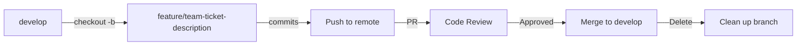
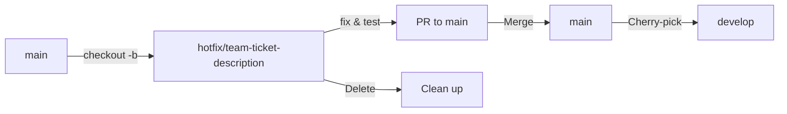

# Organization-Wide Git Branching Strategy

This document defines the git branching strategy and conventions that all teams across the organization must follow. These standards ensure consistency, improve collaboration, and streamline our development and deployment processes.

## Table of Contents
1. [Overview](#overview)
2. [Core Branching Model](#core-branching-model)
3. [Branch Naming Conventions](#branch-naming-conventions)
4. [Workflow Processes](#workflow-processes)
5. [Commit Standards](#commit-standards)
6. [Branch Protection Rules](#branch-protection-rules)
7. [Team-Specific Guidelines](#team-specific-guidelines)
8. [Tool Integration](#tool-integration)
9. [Migration Strategy](#migration-strategy)
10. [Quick Reference](#quick-reference)

## Overview

This branching strategy is designed to:
- Provide consistency across all teams (Software, Marketing, Product, Cyber)
- Enable clear tracking of work items
- Support continuous integration and deployment
- Facilitate collaboration between teams
- Maintain code quality and stability

## Core Branching Model

### Main Branches

```
main (or master)
    │
    ├── develop
    │     │
    │     └── feature branches
    │
    ├── release branches
    │
    └── hotfix branches
```

#### 1. **main** (Production)
- Contains production-ready code
- Protected branch - no direct commits
- All changes via pull requests
- Tagged for releases
- Deployment trigger for production

#### 2. **develop** (Integration)
- Integration branch for features
- Protected branch - no direct commits
- Base for all feature branches
- Regularly updated from main
- Deployment trigger for development environment

#### 3. **staging** (Optional)
- Pre-production testing
- Mirror of production environment
- Final validation before production
- Used for UAT and performance testing

### Supporting Branches

#### Feature Branches
- Created from: `develop`
- Merge back to: `develop`
- Naming: `feature/<team>-<ticket>-<description>`
- Lifespan: Until feature is complete and merged

#### Release Branches
- Created from: `develop`
- Merge back to: `main` and `develop`
- Naming: `release/<version>-<description>`
- Lifespan: Until release is deployed

#### Hotfix Branches
- Created from: `main`
- Merge back to: `main` and `develop`
- Naming: `hotfix/<team>-<ticket>-<description>`
- Lifespan: Until fix is deployed

#### Experimental Branches
- Created from: `develop` or feature branch
- Merge back to: May not merge (disposable)
- Naming: `experiment/<team>-<description>`
- Lifespan: Until experiment concludes

## Branch Naming Conventions

### Universal Format
```
<type>/<team>-<ticket>-<description>
```

### Components

#### Branch Types
| Type | Purpose | Created From | Merges To |
|------|---------|--------------|-----------|
| `feature/` | New functionality | develop | develop |
| `fix/` | Non-urgent bug fixes | develop | develop |
| `hotfix/` | Urgent production fixes | main | main & develop |
| `release/` | Release preparation | develop | main & develop |
| `refactor/` | Code improvements | develop | develop |
| `docs/` | Documentation only | develop | develop |
| `test/` | Test additions/improvements | develop | develop |
| `chore/` | Maintenance, dependencies | develop | develop |
| `experiment/` | Proof of concepts | develop | may not merge |

#### Team Prefixes
| Prefix | Team | Examples |
|--------|------|----------|
| `sw` | Software Development | sw-backend, sw-frontend, sw-api |
| `mk` | Marketing | mk-campaign, mk-content, mk-brand |
| `pd` | Product | pd-design, pd-research, pd-analytics |
| `cy` | Cyber Security | cy-audit, cy-pentest, cy-defense |
| `ops` | Operations/Infrastructure | ops-deploy, ops-monitor, ops-scale |
| `ml` | Machine Learning | ml-model, ml-data, ml-training |
| `doc` | Documentation | doc-api, doc-guide, doc-tutorial |
| `qa` | Quality Assurance | qa-test, qa-automation, qa-perf |

#### Ticket Reference
- Use your team's issue tracking system ID
- Examples: JIRA-123, TASK-456, SEC-789, CARD-321
- If no ticket exists, use ADHOC or create a ticket first

#### Description
- Kebab-case (lowercase with hyphens)
- 2-5 words maximum
- Clear and descriptive
- No special characters except hyphens

### Examples

```bash
# Software team implementing user authentication
feature/sw-JIRA-123-user-authentication

# Marketing team fixing email template
fix/mk-TASK-456-email-template-error

# Cyber team patching security vulnerability
hotfix/cy-SEC-789-sql-injection-fix

# Product team updating API documentation
docs/pd-DOCS-321-api-endpoints

# ML team experimenting with new model
experiment/ml-transformer-architecture

# Release branch for version 2.1.0
release/2.1.0-q4-features

# Operations team updating CI/CD
chore/ops-INFRA-555-update-ci-pipeline
```

## Workflow Processes

### Feature Development Workflow



1. **Create Feature Branch**
   ```bash
   git checkout develop
   git pull origin develop
   git checkout -b feature/sw-JIRA-123-user-auth
   ```

2. **Develop Feature**
   - Make atomic commits
   - Push regularly to remote
   - Keep branch updated with develop

3. **Submit Pull Request**
   - Ensure all tests pass
   - Request reviews from team
   - Address feedback

4. **Merge and Cleanup**
   - Squash commits if needed
   - Delete branch after merge
   - Verify integration in develop

### Hotfix Workflow



1. **Create Hotfix Branch**
   ```bash
   git checkout main
   git pull origin main
   git checkout -b hotfix/cy-SEC-789-critical-fix
   ```

2. **Implement Fix**
   - Minimal changes only
   - Thorough testing
   - Document the issue

3. **Deploy Process**
   - PR to main first
   - Deploy to production
   - Merge back to develop
   - Tag the release

### Release Workflow

1. **Create Release Branch**
   ```bash
   git checkout develop
   git pull origin develop
   git checkout -b release/2.1.0-q4-release
   ```

2. **Release Preparation**
   - Version bumps
   - Release notes
   - Final testing
   - Bug fixes only

3. **Complete Release**
   - Merge to main
   - Tag with version
   - Merge back to develop
   - Deploy to production

## Commit Standards

### Format
Follow [Conventional Commits](https://www.conventionalcommits.org/):

```
<type>(<scope>): <subject>

[body]

[footer]
```

### Types
- `feat`: New feature
- `fix`: Bug fix
- `docs`: Documentation changes
- `style`: Code style changes
- `refactor`: Code refactoring
- `test`: Test changes
- `chore`: Build/tool changes

### Examples
```bash
feat(auth): implement OAuth2 login flow

- Added Google and GitHub OAuth providers
- Implemented token refresh mechanism
- Added user profile synchronization

Closes JIRA-123
```

### Commit Rules
1. Use present tense ("add feature" not "added feature")
2. Limit subject line to 50 characters
3. Capitalize the subject line
4. No period at end of subject
5. Reference tickets in footer
6. Explain what and why, not how

## Branch Protection Rules

### Protected Branches

#### main/master
- ✅ Require pull request reviews (minimum 2)
- ✅ Dismiss stale PR approvals on new commits
- ✅ Require status checks to pass
- ✅ Require branches to be up to date
- ✅ Include administrators in restrictions
- ❌ Allow force pushes
- ❌ Allow deletions

#### develop
- ✅ Require pull request reviews (minimum 1)
- ✅ Require status checks to pass
- ✅ Require branches to be up to date
- ❌ Allow force pushes
- ❌ Allow deletions

### Required Status Checks
- Build must pass
- Tests must pass
- Code coverage thresholds met
- Security scan passed
- Linting passed

## Team-Specific Guidelines

### Software Development Teams
- **Focus**: Clean code, test coverage, performance
- **Additional branches**: `perf/` for performance improvements
- **Requirements**: 
  - Unit tests for all new code
  - Integration tests for APIs
  - Documentation updates
  - Code review by senior developer

### Marketing Teams
- **Focus**: Content versioning, campaign tracking
- **Additional branches**: `campaign/` for marketing campaigns
- **Requirements**:
  - Content review and approval
  - A/B test configurations
  - Analytics tracking verification
  - Brand guideline compliance

### Product Teams
- **Focus**: Feature planning, user experience
- **Additional branches**: `design/` for design iterations
- **Requirements**:
  - Design mockups attached
  - User story acceptance criteria
  - Accessibility compliance
  - Stakeholder approval

### Cyber Security Teams
- **Focus**: Security patches, vulnerability fixes
- **Additional branches**: `security/` for security improvements
- **Requirements**:
  - Security impact assessment
  - Penetration test results
  - Audit trail maintenance
  - Compliance verification

## Tool Integration

### Issue Tracking Integration
- Branch names must reference tickets
- Automate branch creation from tickets
- Link commits to tickets
- Update ticket status on merge

### CI/CD Pipeline Triggers
```yaml
# Example CI/CD configuration
on:
  push:
    branches:
      - main
      - develop
      - 'release/**'
  pull_request:
    branches:
      - main
      - develop
```

### Git Hooks
- Pre-commit: Lint and format code
- Commit-msg: Validate commit format
- Pre-push: Run tests
- Post-merge: Clean up local branches

### Automation Scripts
```bash
# Create feature branch with ticket
git-feature() {
  ticket=$1
  description=$2
  team=$(git config user.team)
  git checkout -b "feature/${team}-${ticket}-${description}"
}

# Usage: git-feature JIRA-123 user-authentication
```

## Migration Strategy

### Phase 1: Education (Week 1-2)
- Team training sessions
- Documentation distribution
- Q&A sessions
- Practice exercises

### Phase 2: Soft Launch (Week 3-4)
- New branches follow conventions
- Existing branches grandfathered
- Gentle reminders on PRs
- Support and guidance

### Phase 3: Enforcement (Week 5+)
- Automated checks enabled
- Non-compliant branches rejected
- Full adoption required
- Regular audits

### Handling Existing Branches
1. Complete and merge ASAP
2. Rename if long-lived:
   ```bash
   git branch -m old-name feature/team-ticket-description
   ```
3. Document exceptions
4. Set deadline for cleanup

## Quick Reference

### Common Commands
```bash
# Start new feature
git checkout develop
git pull origin develop
git checkout -b feature/team-ticket-description

# Update feature branch
git checkout feature/team-ticket-description
git pull origin develop
git merge develop

# Submit changes
git add .
git commit -m "type(scope): description"
git push origin feature/team-ticket-description

# Create hotfix
git checkout main
git pull origin main
git checkout -b hotfix/team-ticket-description

# Tag release
git checkout main
git tag -a v2.1.0 -m "Release version 2.1.0"
git push origin v2.1.0
```

### Branch Lifecycle
1. Create from appropriate base
2. Develop with atomic commits
3. Keep updated with base branch
4. Submit PR when ready
5. Address review feedback
6. Merge when approved
7. Delete after merge

### Do's and Don'ts

✅ **DO**:
- Follow naming conventions exactly
- Keep branches focused and small
- Update branches regularly
- Delete merged branches
- Use meaningful commit messages

❌ **DON'T**:
- Commit directly to main/develop
- Force push to shared branches
- Leave stale branches
- Mix features in one branch
- Use generic commit messages

## Enforcement

### Automated Checks
- Branch name validation
- Commit message linting
- PR template compliance
- Status check requirements

### Consequences
1. **First violation**: Friendly reminder
2. **Second violation**: Required training
3. **Repeated violations**: Escalation to manager

### Support
- Git champions in each team
- Regular workshops
- Updated documentation
- Slack channel: #git-help

---

*Last Updated: [Current Date]*  
*Version: 1.0*  
*Owner: DevOps Team*  
*Questions: devops@company.com*