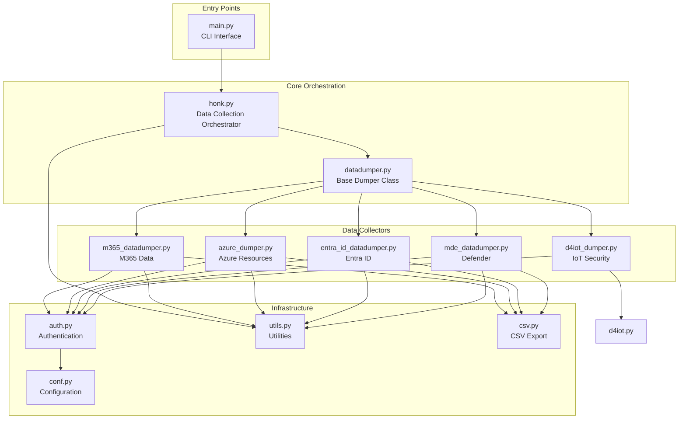

# Goal

Generate comprehensive module documentation for the Goose tool's mdBook in docs/src/developers/modules/, providing top-down analysis of functionality, inter-module
relationships, business purposes, and detailed implementation documentation with visual diagrams.

# Documentation Structure

1. Overview Documentation (docs/src/developers/modules/index.md)

Create a top-level architecture document that includes:

# Goose Tool Module Architecture

## Overview
[High-level description of Goose's purpose as an incident response and hunt tool for Microsoft cloud environments]

## Architecture Diagram


Module Categories

1. Entry Points

- main.py: CLI entry point using Google Fire

2. Core Orchestration

- honk.py: Main orchestration engine
- datadumper.py: Base class for all data collectors

3. Infrastructure Services

- auth.py: Microsoft authentication (MSAL)
- conf.py: Configuration management
- utils.py: Shared utilities and helpers
- csv.py: Data export functionality

4. Data Collectors

- azure_dumper.py: Azure resource collection
- m365_datadumper.py: Microsoft 365 data
- entra_id_datadumper.py: Entra ID/Azure AD
- mde_datadumper.py: Microsoft Defender
- d4iot_dumper.py: Defender for IoT
- d4iot.py: D4IoT base functionality

2. Individual Module Documentation Template

For each module, create a file like docs/src/developers/modules/{module_name}.md:

# {Module Name} Module

## Overview
[Business purpose and high-level functionality]

## Module Information
- **File**: `goosey/{module_name}.py`
- **Lines of Code**: {line_count}
- **Primary Purpose**: {purpose}
- **Dependencies**: {list of internal and external dependencies}

## Business Context
[Explain what business problem this module solves and its role in incident response]

## Architecture Position
```mermaid
graph LR
    subgraph "This Module"
        THIS[{module_name}]
    end

    subgraph "Dependencies"
        DEP1[module1]
        DEP2[module2]
    end

    subgraph "Dependents"
        USER1[module3]
        USER2[module4]
    end

    DEP1 --> THIS
    DEP2 --> THIS
    THIS --> USER1
    THIS --> USER2

Class Structure

classDiagram
    class ClassName {
        +attribute1: type
        +attribute2: type
        +method1() return_type
        +method2() return_type
    }

Key Components

Classes

{ClassName}

Purpose: {business purpose}
Relationships: {how it relates to other classes}

Attributes:
- attribute_name ({type}): {purpose and usage}

Methods:
- method_name(): {business function and how it fits into workflow}

Functions

{function_name}

Purpose: {business purpose}
Signature: def function_name(param1: type, param2: type) -> return_type
Business Use Case: {when and why this is used}
Integration Points: {what calls this and what it calls}

Workflow Diagrams

{Workflow Name}

sequenceDiagram
    participant User
    participant Module
    participant Dependency

    User->>Module: Initiate action
    Module->>Dependency: Request data
    Dependency-->>Module: Return data
    Module-->>User: Process complete

Data Flow

flowchart TD
    A[Input Data] --> B{Processing Logic}
    B -->|Success| C[Transform Data]
    B -->|Error| D[Error Handler]
    C --> E[Output Format]
    D --> F[Log Error]
    E --> G[Write Output]

Error Handling

[Describe error handling patterns and recovery strategies]

Security Considerations

[Authentication requirements, data sensitivity, API key handling]

Performance Characteristics

[Async patterns, batch processing, rate limiting]

Testing Approach

[How to test this module, key test scenarios]

Common Issues and Solutions

[Known problems and their resolutions]

### Review Process Instructions

#### Stage 1: Initial Discovery (Architecture Understanding)
1. Read all modules in this order to understand the flow:
  - `__init__.py`, `main.py` (entry points)
  - `honk.py`, `datadumper.py` (orchestration)
  - `conf.py`, `auth.py`, `utils.py`, `csv.py` (infrastructure)
  - All data dumpers (in size order)

2. For each module, capture:
  - Primary business purpose
  - Key classes and their relationships
  - External dependencies
  - Integration touchpoints

#### Stage 2: Deep Analysis (Implementation Details)
1. Re-read each module focusing on:
  - Method signatures and their business purposes
  - Data flow through the module
  - Error handling strategies
  - Async patterns and concurrency
  - State management approaches

2. Create detailed notes on:
  - How each function serves the business need
  - Complex logic flows that need diagrams
  - Security-sensitive operations
  - Performance-critical sections

#### Stage 3: Relationship Mapping (Integration Analysis)
1. Trace workflows across modules:
  - Authentication flow from CLI to API calls
  - Data collection workflow for each service
  - Error propagation and handling
  - Configuration usage patterns

2. Identify and document:
  - Shared patterns across dumpers
  - Common utility usage
  - Cross-cutting concerns
  - Abstraction hierarchies

#### Stage 4: Documentation Generation
1. Create the overview `index.md` with complete architecture
2. For each module, generate documentation following the template
3. Ensure all diagrams are:
  - Mermaid-compatible for GitLab rendering
  - Focused on business understanding
  - Showing actual relationships from code

### Mermaid Diagram Guidelines

1. **Architecture Diagrams**: Use `graph TB` or `graph LR`
2. **Class Diagrams**: Use `classDiagram` with actual attributes/methods
3. **Sequence Diagrams**: Use `sequenceDiagram` for workflows
4. **Flowcharts**: Use `flowchart TD` for logic flows
5. **State Diagrams**: Use `stateDiagram-v2` for state machines

### Key Focus Areas

1. **Business Context First**: Always explain WHY before HOW
2. **Visual Understanding**: Create diagrams for complex relationships
3. **Integration Points**: Show how modules work together
4. **Real-World Usage**: Include practical examples
5. **Incident Response Focus**: Relate to IR/hunting scenarios

### Expected Deliverables

1. `docs/src/developers/modules/index.md` - Architecture overview
2. `docs/src/developers/modules/main.md` - CLI entry point
3. `docs/src/developers/modules/honk.md` - Orchestration engine
4. `docs/src/developers/modules/datadumper.md` - Base dumper class
5. `docs/src/developers/modules/auth.md` - Authentication system
6. `docs/src/developers/modules/conf.md` - Configuration management
7. `docs/src/developers/modules/utils.md` - Utility functions
8. `docs/src/developers/modules/csv.md` - CSV export
9. `docs/src/developers/modules/azure_dumper.md` - Azure collector
10. `docs/src/developers/modules/m365_datadumper.md` - M365 collector
11. `docs/src/developers/modules/entra_id_datadumper.md` - Entra ID collector
12. `docs/src/developers/modules/mde_datadumper.md` - MDE collector
13. `docs/src/developers/modules/d4iot_dumper.md` - D4IoT collector
14. `docs/src/developers/modules/d4iot.md` - D4IoT base

### Quality Checklist

For each documentation file:
- [ ] Clear business purpose stated upfront
- [ ] Module's role in overall architecture explained
- [ ] All classes/functions documented with business context
- [ ] At least one diagram showing relationships
- [ ] Workflow diagrams for complex processes
- [ ] Integration points clearly identified
- [ ] Security considerations documented
- [ ] Real-world usage examples included
